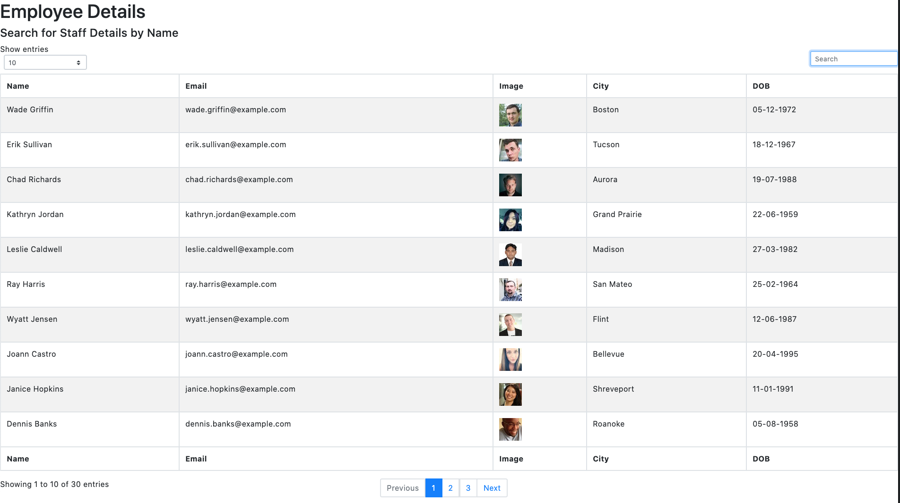
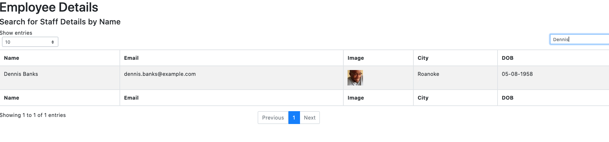

# EmployDirect

## Description

EmployDirect is an app allowing staff details to be searched and results sorted by name to allow staff to find staff and businesses to increase communication between staff.

**## User Story**

* As a user, I want to be able to view my entire employee directory at once so that I have quick access to their information.

An employee or manager would benefit greatly from being able to view non-sensitive data about other employees. It would be particularly helpful to be able to filter employees by name.

# Screenshots

# Build Status

Working app, requires testing and further development 

# Technologies 

 - React
 - HTML
 - Javascript 
 - Node
 - Webpack
 - Axios 
 - mdbreact 
 - moment

 # Installation - (for developers)

 - Requires node js
 - npm install
 - npm start

 # Deployed links 

https://github.com/rorydavidtanner/employdirect

https://rorydavidtanner.github.io/employdirect/